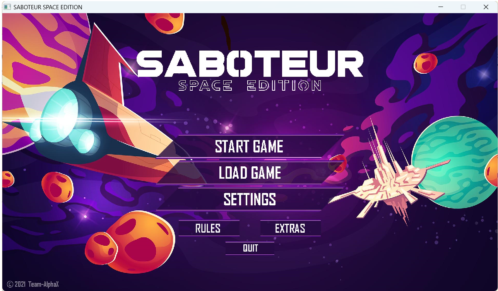
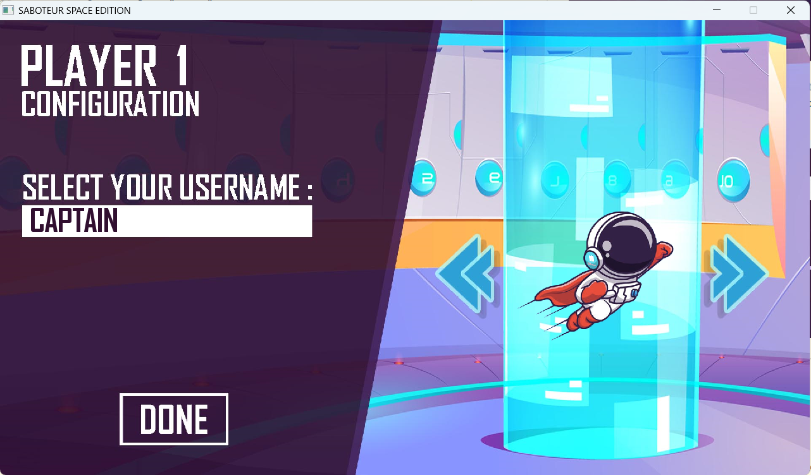
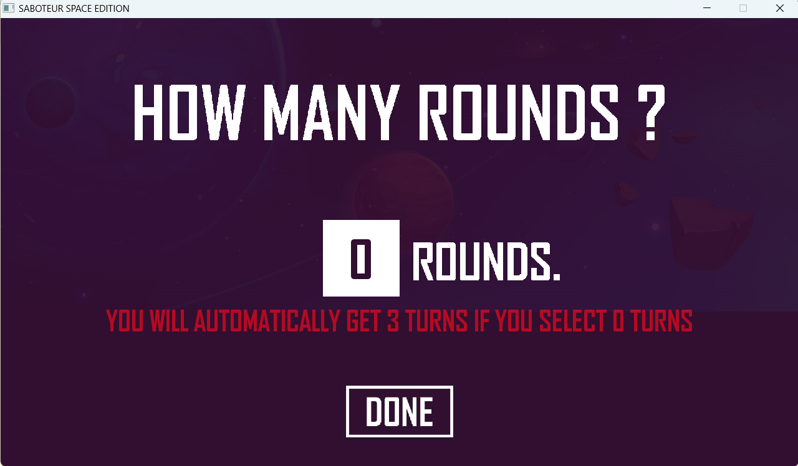
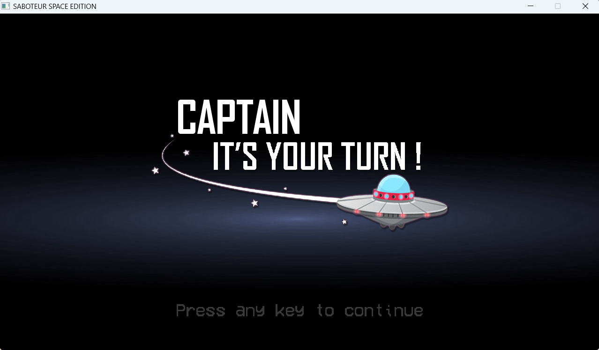
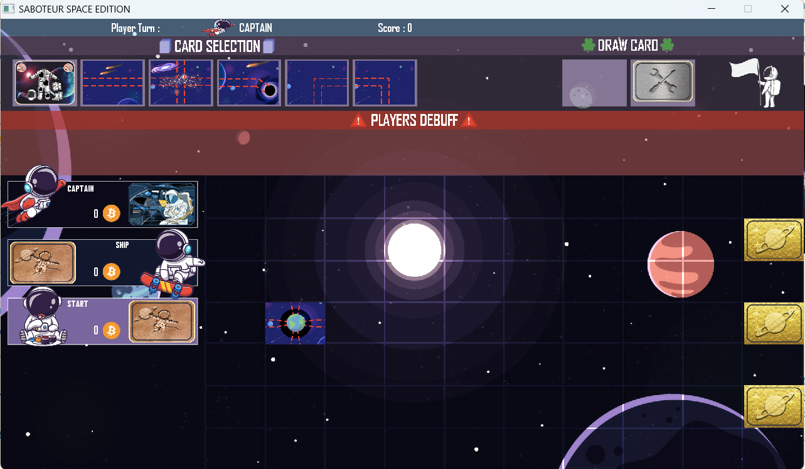
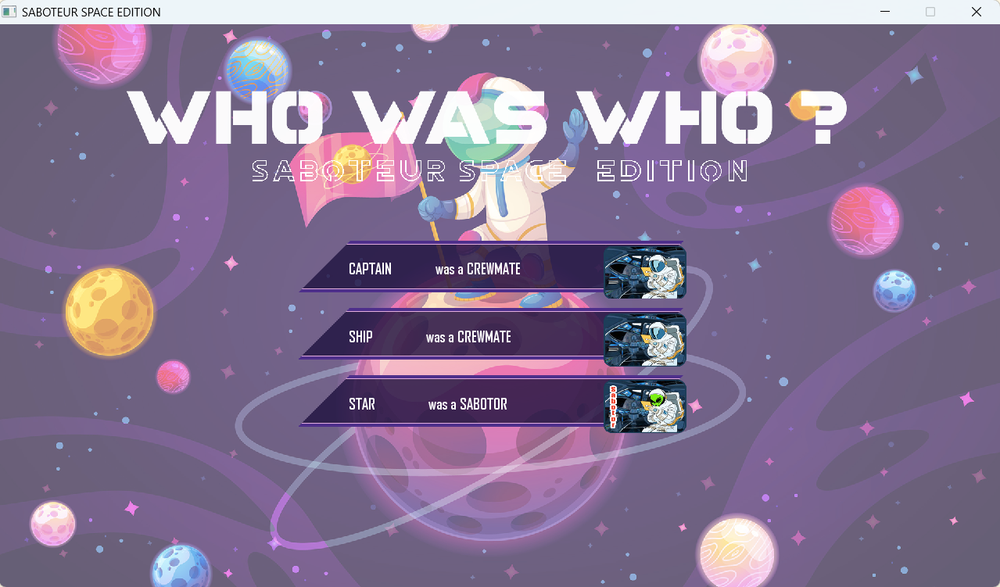
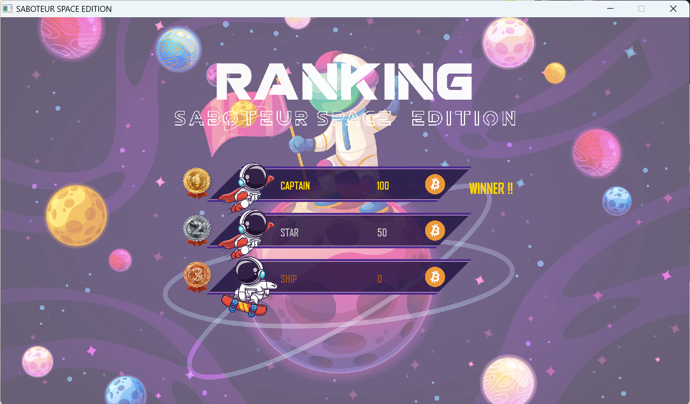
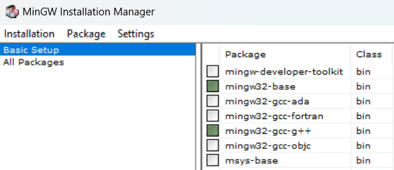

# Saboteur Space Edition Project

## Welcome to Saboteur Space Edition

An evening with friends and nobody knows what to do?
An afternoon with the family and everyone's bored?
Why not try a game of Saboteur?
It would be a great way to pass the time while making sure you have a good time together!

You can adjust your game settings such as resolution, fps and full screen mode on "Settings".

When you start a game, you will first need to specify the number of players from 3 to 5.
You have a slider to select, but you have to click on the possible positions of the slider to actually select a number.

After selecting the number of players, you can select your username with your keyboard (only letters and numbers are managed).

You can also select your super astronaut character : Superman, Skateboarder, Dreamer, Burger Lover and Sushi Man !

<table>
  <tr>
    <th>Superman</th>
    <th>Skateboarder</th>
    <th>Dreamer</th>
    <th>Burger Lover</th>
    <th>Sushi Man</th>
  </tr>
  <tr>
    <td></td>
    <td></td>
    <td></td>
    <td></td>
    <td></td>
  </tr>
</table>

After, you can choose how many games you would like to play.

The game starts and for each player, as it is a local game, we added a break where you have to press a key on the keyboard to continue. 
Sometimes, it isn't taking into account you press a key, so make sure you are still on the game window by clicking with your mouse.

CAPTAIN can start the game, and you'll see the board you'll be interacting with.
At the top left, these are the cards CAPTAIN can play with.

At the top right, you have de deck but also a white astronaut.
The white astronaut is there if you want to stop your turn (either nothing more to do or a bug).

On the left, you can see the player, and the one who is playing has his card revealed (to make sure you don't forget your role).
On the board, you will the starting line with the earth and on the right 3 hidden planets with crystals.
If a player gives you a debuff, it will appear on the "PLAYERS DEBUFF" area.

Finally, it's the end of the round, you will know who was the sabotor during the round.

At the end of all the rounds, you will get the ranking and the winner!

--- 

## Rules

### **Game Story :**
Players take on the role of either an astronaut trying to reach a planet or an alien trying to block their path. Roles are hidden, and teams must work together while guessing each other's identities.

- **Astronauts win**: They must build a path to the planet to earn galactic crystals.
- **Aliens win**: If astronauts fail, aliens earn the crystals instead.

The player with the most crystals at the end of all rounds wins the game.

### **Game Setup :**
- Each player receives a hidden role (astronaut or alien), distributed based on the number of players:
    - **3 players**: 1 alien, 2 astronauts
    - **4 players**: 1 alien, 3 astronauts
    - **5 players**: 2 aliens, 3 astronauts
- Roles remain secret until the end of the round.

#### **Card Distribution:**
- **3 to 4 players** → 6 cards in hand.
- **5 to 8 players** → 5 cards in hand.
- Remaining cards form a face-down draw pile.

#### **Board Setup:**
- **1 starting card** (showing Earth).
- **3 arrival cards** (planets).
- Players must create a path from the starting card to one of the planets.

#### **Gameplay:**

On each turn, the player can:

- Place a card on the game board.
- Place an action card on one of the players.
- Draw a new card into their hand.

Or,
- Discard 3 cards and end your turn

If the player places a card, they must draw a new one from the deck (automatic). 
Their turn is then over, and it is the next player's turn. 
A path card must always be placed next to another path card. 
Additionally, all paths leaving a card must continue on the adjacent card in the same direction.

### **End Game:**
If all players can no longer place cards on the board or if all players' hands are empty, then the game is over.
Players can also give up if the path to all the cards seems impossible.

### To your spaceships!

---

## Launch the game on your computer

In order to play the game, you will need a specific version of MinGW adapted to the Allegro5 library used in the project.
The library is given as a zip file in the GitHub repository.

You will first have to get the [MinGW Installation Manager ](https://sourceforge.net/projects/mingw/) to get "mingw32-base bin" and "mingw32-gcc-g++ bin".

MinGW will be installed at the root of your computer, on Windows, you can follow the path "C:\MinGW".

As you unzip the library, you will get 3 folders : include, bin and lib.
You will take those folders and fuse them with the already existing folders of MinGW.
You're now free to play !

I didn't try on other OS, but I know we had somme issues with a MAC. (The CMakeList needs to be updated to be usable in this case.)

## Sub-files, folders and utilities

In this folder, you will find the following subfolders:

* `main.c` :   
* `Subfolder "fonts"` : Contains the font   
* `Subfolder "images"` : 
 Contains all the bitmaps (Subfolder (Card_Action (players' actions), Card_board (movement cards), Card_ending (arrival cards with treasures), Card_Player (Astronaut/Saboteur), Title_Screen (Menu/Option)))  
* `Subfolder "src"` : Contains the `.c` and `.h` subfiles   

Within these subfolders, you will find the following sub-subfolders:

* `Sub-subfolder "bandeson"` : Contains the game music   
* `Sub-subfolder "board"` : Contains all the functions that manage the display on the screen  
* `Sub-subfolder "card_suffle"` : Contains all the functions that manage the card draw  
* `Sub-subfolder "initialization"` : Contains all the functions that initialize the player's hand, the game board, etc.  
* `Sub-subfolder "structures"` : Contains all the structures (card information, player information)   
* `Sub-subfolder "title_screen"` : Contains all the functions that allow resizing the window   
* `Sub-subfolder "player_turn"` : Contains all the functions that manage the player's turn  
* `Sub-subfolder "Rules"` : Contains all the functions that manage the rules (positions)   
* `Sub-subfolder "AlphabetPourLesNuls"` : Contains a transformation of the ASCII table with the ALLEGRO table to retrieve key inputs  

## Problems and improvements

The game has some issues with loading saved progress. We do not recommend quitting the game with the intention of resuming it later.

You can adjust the game’s resolution, but playing in full screen results in lag, and the game mechanics don't function correctly.

## Team composition & Credits

The group is composed of 3 first-year students from ECE-Lyon:  

<table>
  <tr>
    <td><a href="https://github.com/jonathan971">VELIN Jonathan</a></td>
    <td><a href="https://github.com/hugoscatena">SCATENA Hugo  </a></td>
    <td><a href="https://github.com/PaulNavon">NAVON Paul</a></td>
  </tr>
</table>

We thank our computer science teacher, <a href="https://github.com/antoinehintzy">Mr. Hintzy</a>, for the valuable help he provided us throughout this project.

